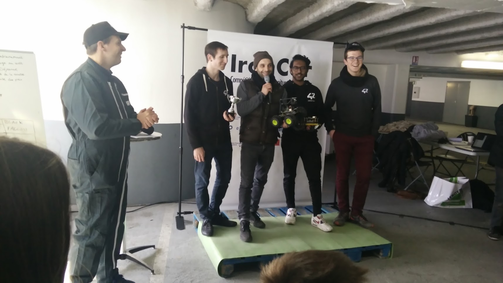

# Patate42
An autonomous RC car to compete the IronCar Challenge...



Patate42 won the first (and third) french IronCar race edition !!!

# Hardware Config :

	* Tamyia TT-02 4WD RC car + larger wheels
	* RaspberryPi 3B + battery pack (we use a Kuman)
	* Rpi camera (depends on your taste, we use a wide angle fisheye)
	* Adafruit PWM Hat
	* Jumper cables, ...

# Installation :

## on Raspberry :

```
git clone https://github.com/EParisot/Patate.git
cd Patate
pip install -r requirement.txt
```

To use a Xbox gamepad :
```
sudo apt-get install xboxdrv
```

## on Computer :

```
git clone https://github.com/EParisot/Patate.git
cd Patate/Data_processing/Training
pip install -r requirement.txt
```

# Usage :

## Collect Data (manual drive + take images/labels) (RPi) :

```
cd Data_processing
sudo python Auto_datamining_pad.py 0.1
```
to take one picture every 0.1 sec (to just control without taking pictures, don't specify any value)

If you don't have Xbox Gamepad, you can use the computer keyboard
(opencv needed, to install opencv on your RPi : https://www.pyimagesearch.com/2016/04/18/install-guide-raspberry-pi-3-raspbian-jessie-opencv-3/)

```
cd Data_processing
python Auto_datamining_key.py 0.1
```

Or you can use the built-in car controler and labelise by hand later:
(opencv needed)
```
cd Data_processing
python Manual_datamining.py
```

## Data Augmentation / Balancing (computer):

All pictures goes to Patate/Pics/Auto or Patate/Pics/Manual (create folder(s) if needed)

Augmentation scrits can be found in Patate/Data_processing/Augmentation

usages:

```
python 5to3.py [folder]		-> turn 2speeds/5directions labels into 2speeds/3directions
python b_w.py [folder]		-> turn all pictures black and white
python rename.py [folder]	-> rename pictures direction label with the folders name (ex: rename '0_4_4565432345.jpg' to '0_0_4565432345.jpg' in '/0' folder)
python tags.py [folder]		-> retag discrete to categorical labels
python reverse.py [folder]	-> apply a mirror effect on pics by value (comment/uncomment) and rename to opposite value (and add a 'r' in filename)
```

## Train model (Computer) :

```
cd Patate/Data_processing/Training
jupyter notebook
```

## AutoPilot (RPi) :

```
cd Patate

python patateScript5.py [myModel.h5]

or

python patateScript5_threaded.py [myModel.h5]

or

python patateScript3.py [myModel.h5]

or

python patateScript3_threaded.py [myModel.h5]
```

